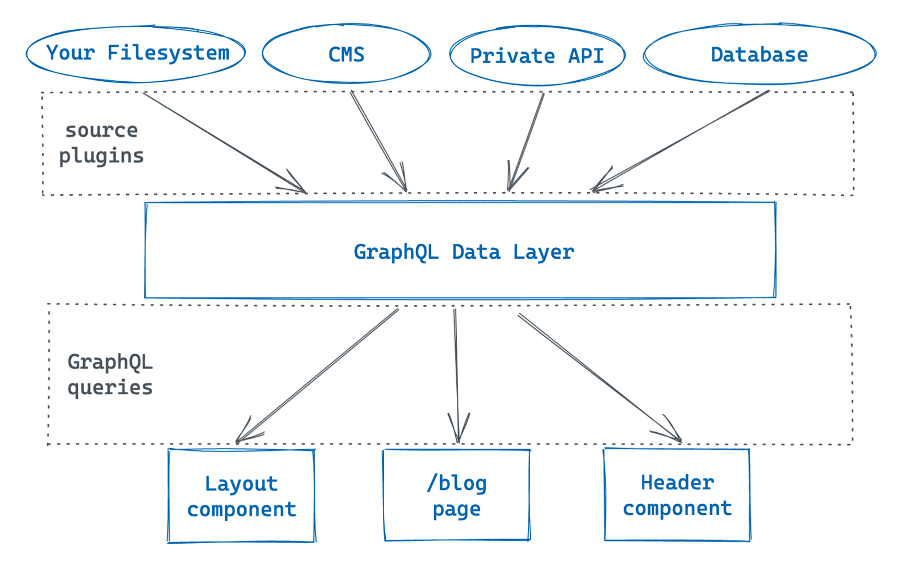

# Gatsby Routing System

gatsby는 SSG를 기본으로 하는 프레임워크이기 때문에 **우선적으로 `SSG`를 중심**으로 구현을 하였다. 하지만 gatsby에서도 `CSR / SSR / DSG` 와 같은 다른 랜더링 옵션들을 제공한다.

1. SSG : 빌드 시점에 라우팅을 생성(based File System)

   - 기본적으로 `pages 폴더` 안에 컴퍼넌트를 추가하면 그 파일 시스템 구조대로 URL이 형성된다.

- 정적 라우팅(static routing)

  - URL과 pages 하위 컴퍼넌트간에 자동으로 맵핑되는 구조 (like Next.js)

- 동적 라우팅(dynamic routing) (ex. blog 상세 페이지)

  - `gatsby-node.js`에서 `createPages`를 통해 필요한 페이지를 구현

  - graphQL data 계층의 collection을 활용하여 페이지 구현

    - `{ }` 안에 collection의 필드값에 맞는 파일명으로 파일을 생성하면 빌드시점에 gatsby가 파일명을 파싱하여 그에 맞는 graphQL을 자동 호출하고, 해당 데이터로 페이지를 구현하게 된다.

    - 위에서처럼 collection을 이용해서 라우팅을 만든다고 해서 이를 `collection routes`라고 한다. ([자세히](https://www.gatsbyjs.com/docs/reference/routing/file-system-route-api/#collection-routes))

2. [CSR](https://www.gatsbyjs.com/docs/how-to/routing/client-only-routes-and-user-authentication/) : 순수 리액트에서의 라우팅 방식 이용하는 것(based [Reach Router](https://reach.tech/router/))

3. [SSR](https://www.gatsbyjs.com/docs/conceptual/rendering-options/#server-side-rendering-ssr)

4. [DSG](https://www.gatsbyjs.com/docs/conceptual/rendering-options/#deferred-static-generation-dsg)

# Gatsby Image plugin

gatsby에서는 두가지 Image Component API를 제공한다, `StaticImage Component`와 `GatsbyImage Component` 이다. `gatsby-image-plugin` 플러그인을 사용하면 가장 좋은 점은 **이미지 최적화**를 알아서 처리해준다는 것이다, 마법처럼 🧙🏻‍♂️!

- StaticImage Component vs GatsbyImage Component

  컴퍼넌트에서 항상 같은 이미지를 보여줘야한다면, StaticImage를 사용하는 것이 좋다. 하지만 이미지를 컴퍼넌트에서 props을 통해서 받아야하는 경우, 같은 컴퍼넌트임에도 이미지가 조건에 따라서 변경되어야한다면, 이런 경우 GatsbyImage를 사용하는 것이 좋다.

- 스타일 관련 주의사항

StaticImage 컴퍼넌트를 사용하는 경우, 컴퍼넌트에서 제공하는 props를 통해서 스타일을 바꾸는 것을 권장한다. 나는 styled-components를 사용했는데, HOC패턴으로 이미지 컴퍼넌트를 감싸서 스타일을 오버라이딩하는 경우 작동하지 않는다. 또한 해당 컴퍼넌트에서 사용하는 props을 다른 컴퍼넌트에서 받아서 사용하는 경우도 작동하지 않는다. StaticImage 컴퍼넌트가 포함된 컴퍼넌트에서 정적으로 있는 값을 변수로 넘겨주는 것은 가능하다. 왜 안되는지를 생각해보면, props을 통해서 전달되는 값이라는 것 자체가 react가 작동한다는 말인데(CSR), StaticImage 컴퍼넌트는 빌드시 해당 이미지를 넣어주는 개념이기 때문에 제대로 작동이 안되는게 맞다라는 결론을 얻었다.

>

# GraphQL in Gatsby

> graphQL에 대한 개념보다 gatsby에서 graphQL을 어떤 식으로 사용하는지에 중점을 두고 사용하였다. gatsby에서 graphQL을 사용하기 편리한 이유는 `GraphiQL`이라고 불리는 graphQL 쿼리를 통해서 어떤 데이터가 오는지를 확인할 수 GUI가 존재하기때문이다. 아주 아주 편리함! graphQL에 대해서 몰라서 간편하게 사용할 수 있어서 개발경험이 좋았다.

- graphql

  `graphql`이라는 키워드를 통해서 **pages 컴퍼넌트**에서는 데이터를 패칭할 수 있다. 페이지 컴퍼넌트가 빌드될때 해당 쿼리를 통해서 받은 데이터를 가지고 페이지를 빌드하게된다. 공식 문서에는 이를 `page queries`라고 부른다.

- useStaticQuery hook

  `useStaticQuery`는 **일반 컴퍼넌트**에서 쿼리을 하기 위한 훅으로서 이 역시 **빌드타임**에 쿼리를 할 수 있도록 만들어진 훅이다. 리액트에서의 훅과 같은 규칙이 적용된다.(그냥 진짜 훅임!) 공식 문서에서는 이를 `static queries`라고 부른다.

- page queries vs static queries

  - page queries : 변수를 사용할 수 있다. 특정 데이터만을 가져오기 위해서 사용할 수 있다. 여기서는 블로그 상세로 진입할 때, 유저가 클릭한 포스트에 맞는 데이터를 상세 페이지에 노출하기 위해서 사용하였다. (보호동물 상세의 경우도 마찬가지!) 이 때 상세페이지가 매번 다르기 때문에 유저가 클릭한 부분에 대한 id(or slug) 같은 것들을 graphql의 변수로 넣어줄 수 있다.

    ```graphql
      query Post($frontmatter__slug: String) {
        mdx(frontmatter: { slug: { eq: $frontmatter__slug } }) {

          <!-- 받아올 데이터 필드 -->

        }
      }
    ```

    또 한가지 차이점은 page 컴퍼넌트의 `탑레벨`에서만 사용이 가능하다.

  - static queris : 변수를 사용할 수 없다. 컴퍼넌트 내부에서 사용이 가능하다.(page 컴퍼넌트 안에서도 사용이 가능.) 하지만, `src 내부`에서만 사용이 가능하다.

- gatsby-plugin-typegen

  graphQL을 사용할 때, graphQL에서 받아오는 데이터들의 타입을 자동을 지정해주는 플러그인이다. 버전 4.X 때에는 타입을 해당 플러그인을 설치함으로서 타입을 생성해줘야하는 번거로움을 막을 수 있었다고 한다. 그런데 이제는 해당 플러그인이 자동으로 설치되어 있다. 이 부분때문에 타입에 대한 번거로움이 많이 사라진듯 싶다. 👍

- 아래 이미지는 `GraphQL Data Layer`에 대해서 잘 도식화하여 추가해보았다.
  

# MDX in Gatsby

- mdx

  markdown 파일에서 jsx,tsx를 허용하는 파일을 말한다.

- frontmatter

  mdx파일의 상단에 해당 파일에 대한 metadata를 기록해 놓을 수 있다. 이것을 `frontmatter` 라고 한다. 아래 예시와 같은 형식으로 적어줘야한다. (`--- ~ --- 3개짜리 하이픈 사이`) 이렇게 frontmatter에 명시해놓은 필드값들을 graphql의 쿼리를 통해서 받아올 수 있다.

  ```mdx
  ---
  title: 자바스크립트 Date 비교하기
  category: javascript, date
  date: '2023-05-15'
  author: jjanmo
  slug: compare-date-using-javascript
  image: date.jpg
  ---

  # Hello World
  ```

# Sourcing from [Contentful](https://www.contentful.com/)

gatsby는 다양한 데이터소스를 연결할 수 있도록 여러가지 장치를 제공해준다. 그 중 Contentful은 gatsby와 연결이 가능한 CMS(Content Management System)이다. 말그대로 컨텐츠(데이터)에 대한 CRUD가 가능한 GUI를 제공해주어서 개발자가 아닌 사람들이 좀 더 빠르고 쉽게 데이터를 컨트롤 할 수 있도록 도와준다.

> 다양한 CMS와 연결이 가능하기때문에 내가 어떤 CMS를 사용할지에 따라서 [해당 가이드](https://www.gatsbyjs.com/docs/how-to/sourcing-data/headless-cms/#popular-cmss)를 통해서 플러그인만 설치하면된다! SO GOOD!!
